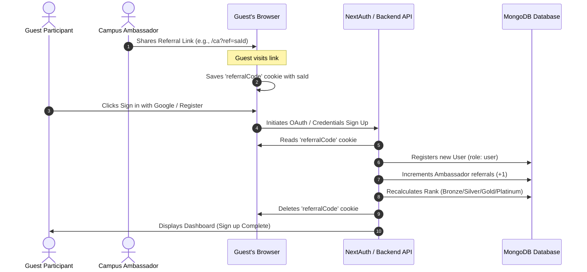
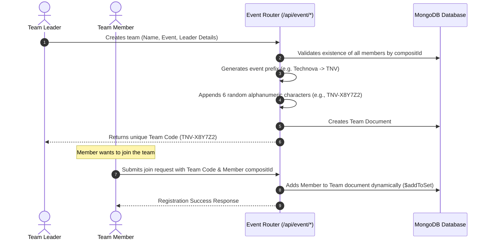
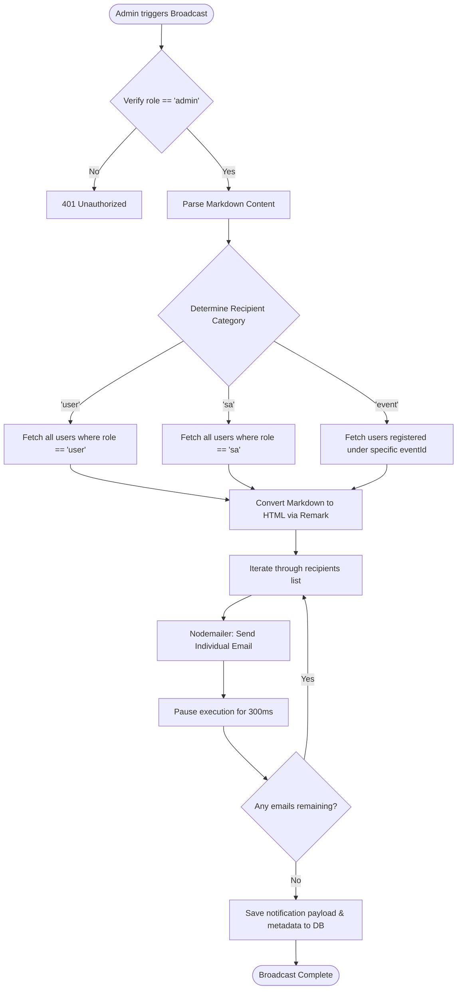

# 🚀 COMPOSIT Official - Project Documentation

Welcome to the official documentation of **COMPOSIT**, the comprehensive, full-stack platform built for managing events, registrations, user roles, accommodations, and Campus/Student Ambassador (CA) operations for the annual Materials Science & Metallurgy Fest of IIT Kharagpur.

---

## 📌 Table of Contents
1. [System Architecture](#-system-architecture)
2. [Technology Stack](#-technology-stack)
3. [Database Models & Entity Relations](#-database-models--entity-relations)
4. [Key Feature Workflows](#-key-feature-workflows)
5. [Directory Structure](#-directory-structure)
6. [Environment Configuration](#-environment-configuration)
7. [Installation & Local Setup](#-installation--local-setup)

---

## 🏛 System Architecture

COMPOSIT is designed as a modular, unified Next.js application using the App Router. The backend is integrated directly into Next.js using API Route handlers, and MongoDB handles the data layer via Mongoose.

```mermaid
graph TD
    %% User Roles
    subgraph Client Roles
        Admin[Admin User]
        SA[Campus/Student Ambassador]
        RegUser[Regular Participant]
    end

    %% Web UI Pages
    subgraph Next.js Frontend (Next.js 16 + React 19)
        LP[3D Landing Page - Spline]
        Home[Home & Events Portal]
        CAP[CA Portal & Leaderboard]
        AP[Admin Dashboard]
    end

    %% Auth & Middleware
    subgraph Security Layer
        NextAuth[NextAuth.js v5 Auth Middleware]
        Bcrypt[Bcrypt.js Hashing]
    end

    %% Backend Controllers
    subgraph Next.js Backend APIs
        AuthAPI[Auth Endpoints /api/auth]
        EvAPI[Event & Team Endpoints /api/event]
        AccAPI[Accommodation Endpoints /api/accommodation]
        AdminAPI[Admin Operations /api/admin]
        UploadAPI[Cloudinary Upload /api/upload]
    end

    %% Database & External Services
    subgraph External & Storage Services
        Mongo[(MongoDB Database)]
        Cloudinary[Cloudinary Media Storage]
        SMTP[SMTP Email Services / Nodemailer]
    end

    %% Client Routing Connections
    RegUser --> LP
    RegUser --> Home
    SA --> CAP
    Admin --> AP

    %% Frontend to API & Security
    LP & Home & CAP & AP --> NextAuth
    NextAuth --> AuthAPI & EvAPI & AccAPI & AdminAPI & UploadAPI
    AuthAPI --> Bcrypt

    %% Backend to Database & Integrations
    AuthAPI & EvAPI & AccAPI & AdminAPI --> Mongo
    UploadAPI --> Cloudinary
    AdminAPI & AuthAPI --> SMTP
```

### Architectural Highlights

1. **Authentication (NextAuth.js v5)**: Operates statelessly with JWT tokens, managing user roles (`user`, `admin`, `sa`). Includes credentials-based login and Google OAuth integration.
2. **Dynamic 3D Interactions (Spline & Framer Motion)**: Seamless integration of rich 3D elements for first-impression landing visuals, layered with Framer Motion transitions.
3. **Resilient Database Connectivity**: Utilizes a globally cached Mongoose client to prevent connection pool exhaustion during Next.js hot reloads and serverless execution scale-ups.
4. **Media Handling**: Secure streaming of uploaded accommodation receipts directly to Cloudinary storage via multipart form buffers, avoiding local file caching.
5. **Bulk Mailing & Notifications**: Scalable Nodemailer SMTP integrations featuring programmatic rate-limiting (300ms delay per email) to comply with mail server provider limits.

---

## 🛠 Technology Stack

| Layer | Technology | Purpose |
| :--- | :--- | :--- |
| **Framework & Engine** | Next.js (v16.0.7), React (v19.2.0), TypeScript | Core application shell, routing, hydration, typesafe logic. |
| **Styling & Theme** | Tailwind CSS (v4), PostCSS, CSS Variables | Utility-first styling with modern native configuration. |
| **Animations & 3D** | Framer Motion, Spline React Toolkit | Interactive 3D graphics, hover states, micro-animations. |
| **Database & ODM** | MongoDB, Mongoose | NoSQL persistence, document validations, relation modeling. |
| **Authentication** | NextAuth.js (v5 Beta) | Secure JWT-based multi-role session management. |
| **Media Storage** | Cloudinary SDK | Upload and storage of verification & payment screenshots. |
| **Mail Deliveries** | Nodemailer | Transactional OTP verification & bulk administrative mailing. |
| **UI Components** | Lucide React, React Markdown Editor | Rich visual icons and administrative markdown composer. |

---

## 🗃 Database Models & Entity Relations

The data layers are model-driven. Each document fits a specific mongoose schema located in [models](file:///d:/COMPOSIT-Official/models).

```mermaid
erDiagram
    USER {
        ObjectId id PK
        string name
        string email UK
        string password
        string mobile UK
        string compositId UK
        string role "user | admin | sa"
        string collegeName
        string saId
        string referralLink
        int numberOfReferrals
        string SARank "Bronze | Silver | Gold | Platinum"
        ObjectId team FK
        ObjectIdArray registeredEvents FK
        boolean isVerified
    }
    
    EVENT {
        ObjectId id PK
        string eventName "Technova | Enigma | Excavate | Metaclix | Case Study | Ideathon | Meta Code | Cadvolution | Ore2Equity"
        string eventId UK
        ObjectIdArray registrations FK
    }

    TEAM {
        ObjectId id PK
        string teamName
        string teamId UK
        string event
        string leaderId FK
        Array members "name, compositId"
    }

    ACCOMMODATION {
        ObjectId id PK
        string compositId FK
        string phone
        string date
        string hallName
        string screenshot "Cloudinary URL"
        boolean isApproved
    }

    NOTIFICATION {
        ObjectId id PK
        ObjectId sentBy FK
        string category "user | sa | event"
        ObjectId eventId FK
        string subject
        string bodyMarkdown
        int recipientsCount
        date sentAt
    }

    USER ||--o[ USER : "referredBy"
    USER ||--o| TEAM : "belongs to"
    USER ||--o{ EVENT : "registers for"
    TEAM ||--o| USER : "led by"
    ACCOMMODATION }o--|| USER : "booked by"
    NOTIFICATION }o--|| USER : "sent by"
```

### 1. User Schema ([user.model.ts](file:///d:/COMPOSIT-Official/models/user.model.ts))
*   **Composit ID**: Unique ID generated with the pattern `CMP-26-[A-Z0-9]{5}` using [generateCompositId.ts](file:///d:/COMPOSIT-Official/lib/generateCompositId.ts).
*   **Roles**: Supported values are `user` (default), `sa` (Campus Ambassador), and `admin`.
*   **Referral Engine**: Holds referral indicators (`saId`, `referralLink`, `numberOfReferrals`, `SARank`).

### 2. Event Schema ([event.model.ts](file:///d:/COMPOSIT-Official/models/event.model.ts))
*   Tracks user registrations for major fest events including:
    *   *Technova, Enigma, Excavate, Metaclix, Case Study, Ideathon, Meta Code, Cadvolution, Ore2Equity*.

### 3. Team Schema ([team.model.ts](file:///d:/COMPOSIT-Official/models/team.model.ts))
*   Tracks team names, member arrays (mapping names to unique `compositId`s), and custom team codes.

### 4. Accommodation Schema ([accommodation.model.ts](file:///d:/COMPOSIT-Official/models/accommodation.model.ts))
*   Stores room/hall requests, uploaded screenshot payment logs, approval flags (`isApproved`), and assigned residential hall names (`hallName`).

### 5. Notification Schema ([notification.model.ts](file:///d:/COMPOSIT-Official/models/notification.model.ts))
*   Maintains logging details of administrative newsletters, marketing broadcasts, or schedule announcements.

---

## 🔄 Key Feature Workflows

### A. Campus Ambassador Referral Loop
The program uses cookies to capture referral signals when a visitor clicks a Campus Ambassador referral link.



> [!NOTE]
> **Ambassador Ranking Tier Map:**
> *   **Bronze:** 1+ Referrals
> *   **Silver:** 20+ Referrals
> *   **Gold:** 35+ Referrals
> *   **Platinum:** 50+ Referrals

---

### B. Event Registration & Team Creation
Events require team codes (prefixes mapped to specific fests).



---

### C. Admin Bulk Broadcasting Engine
Allows site administrators to communicate critical updates directly to target subsets.



---

## 📂 Directory Structure

Here is a map of the folders and files in the repository:

```bash
composit-official/
├── app/                        # Next.js app router
│   ├── (Admin_Portal)/         # Routing group for Administration tasks
│   │   └── admin/              # Admin pages (events, participants, ambassadors, accommodations, notifications)
│   ├── (CA_Portal)/            # Routing group for Campus Ambassador operations
│   │   └── ca/                 # Ambassador dashboard, leaderboard, signin, and registrations
│   ├── (Event_Portal)/         # Routing group for Public Website & Fests
│   │   ├── (activities)/       # Schedule, Events, Guest lectures, Interactive sessions
│   │   ├── accommodations/     # Information & payment receipt submissions
│   │   └── our-team/           # Team showcases
│   └── api/                    # Server-side API endpoints
│       ├── accommodation/      # Bookings and approvals
│       ├── admin/              # Admin controls (events, users, and broadcasts)
│       ├── auth/               # OTP generator, sign-ins
│       └── event/              # Team registrations and joins
├── components/                 # Reusable UI React Components
├── lib/                        # Services, utility modules, and configuration
│   ├── bulkEmail.ts            # Rate-limited email sender
│   ├── cloudinary.ts           # Cloudinary SDK settings
│   ├── db.ts                   # Cached MongoDB connection layer
│   ├── generateCompositId.ts   # Code builder for unique User IDs
│   └── mail.ts                 # OTP & Transactional mail templates
├── models/                     # Mongoose Schema definitions
├── public/                     # Static media and asset configurations
├── auth.ts                     # NextAuth v5 server configuration
├── next.config.ts              # Next.js config
├── tailwind.config.ts          # Styling tokens
└── package.json                # Project dependencies
```

---

## ⚙️ Environment Configuration

To run the application locally or in production, you must set up a `.env` file in the root directory:

```ini
# Database Connection
MONGO_URI=mongodb+srv://<user>:<password>@cluster0.mongodb.net/composit

# NextAuth Configuration
AUTH_SECRET=your_nextauth_jwt_signing_secret_key
NEXT_PUBLIC_APP_URL=http://localhost:3000

# Google OAuth Keys
GOOGLE_CLIENT_ID=your_google_oauth_client_id
GOOGLE_CLIENT_SECRET=your_google_oauth_client_secret

# SMTP Mail Server (e.g., Hostinger / Gmail App Passwords)
SMTP_HOST=smtp.yourhost.com
SMTP_PORT=465
SMTP_USER=no-reply@composit.in
SMTP_PASS=secure_smtp_password
SMTP_FROM=no-reply@composit.in

# Cloudinary Integration (Image Uploads)
CLOUDINARY_CLOUD_NAME=your_cloudinary_cloud_name
CLOUDINARY_API_KEY=your_cloudinary_api_key
CLOUDINARY_API_SECRET=your_cloudinary_api_secret
```

---

## 🛠 Installation & Local Setup

### 1. Prerequisites
Ensure you have the following installed:
*   [Node.js](https://nodejs.org) (v18.x or v20.x recommended)
*   [MongoDB](https://www.mongodb.com/try/download/community) (Local server or Cloud Atlas cluster)

### 2. Step-by-Step Installation

1.  **Clone the repository:**
    ```bash
    git clone https://github.com/sushabhan878/COMPOSIT-Official.git
    cd COMPOSIT-Official
    ```

2.  **Install project dependencies:**
    ```bash
    npm install
    ```

3.  **Set up configuration environment variables:**
    *   Create a file named `.env` in the root of the project.
    *   Copy variables from the [Environment Configuration](#-environment-configuration) section above and populate your values.

4.  **Start development server:**
    ```bash
    npm run dev
    ```
    The application will be running at [http://localhost:3000](http://localhost:3000).

5.  **Build production package:**
    ```bash
    npm run build
    ```
    The optimized production assets will be built in the `.next` directory.

---

> [!TIP]
> Make sure to verify your SMTP server configuration prior to testing the user signup flow, as an invalid connection will cause transactional verification mail triggers to fail.
